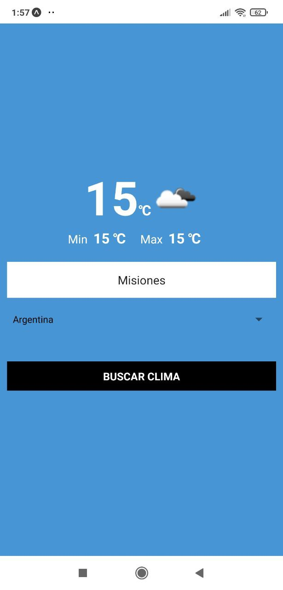

# Sunny
App en react-native para ver el clima de ciudades de diferentes paises.

## Tecnologias Usadas:
1. expo-cli: [Expo Install](https://docs.expo.dev/get-started/installation/)
2. Axios para realizar los request: [Axios](https://axios-http.com/docs/intro)

## Componentes principales
1. App: Componente principal de navegacion.
2. Formulario: Toma los datos para poder realizar la consulta a la api:[OpenWeatherMap](http://openweathermap.org)
3. Clima: Realiza la consulta de los datos obtenidos desde el formulario en la api:[OpenWeatherMap](http://openweathermap.org)

## Vista de la app

